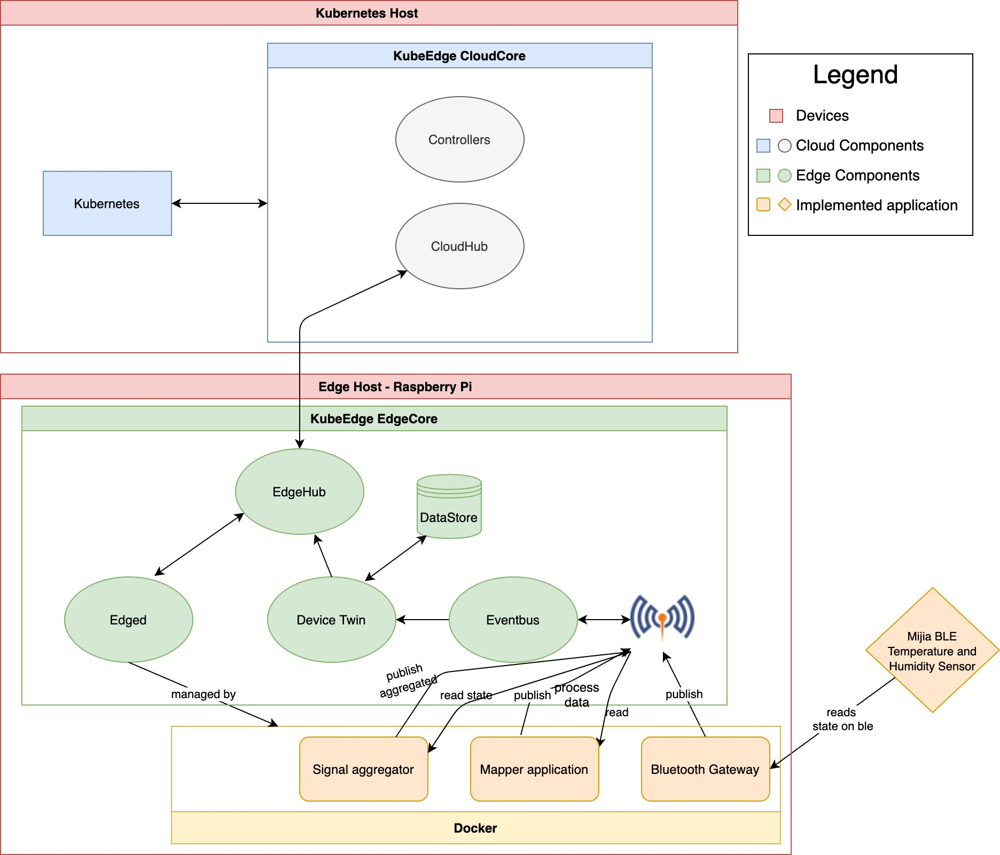

# KubeEdge Temperatue and Humidity Sensor Demo

## Description

This demo requires the user to have two 

Counter run at edge side, and user can control it in web from cloud side, also can get counter value in web from cloud side.




## Prerequisites

### Hardware Prerequisites

* RaspBerry PI (RaspBerry PI 3 Model B+ has been used for this demo). Bluetooth connection is a must.

### Software Prerequisites

* A running Kubernetes cluster.

* KubeEdge v1.8.1+

* MQTT Broker is running on Raspi.

## Steps to run the demo

**Note: instances must be created after model and deleted before model.**

### Create the device model and device instances in Kubernetes for the temperature and humidity sensor

In this step, we create the device model and the instances for the temperature and humidity sensor using the yaml files.
Execute the below commands in the directory the repository was cloned to.

##### Execute below commands on the cloud node

```console
$ sed -i 's/<edge_node>/<name_of_edge_node>/g' crds/hudtemp-*.yaml
$ kubectl create -f crds/hudtemp-model.yaml
$ kubectl create -f crds/hudtemp-instance1.yaml
$ kubectl create -f crds/hudtemp-instance2.yaml
$ kubectl create -f crds/hudtemp-aggregated.yaml
```

### Preparation of Bluetooth Gateway application

The Bluetooth Gateway application connects to the sensor and publishes the measurements via MQTT.
For this to work, the user has to create the Docker images of the Bluetooth Gateway so it knows what to connect to (aka. has the correct configuration).

##### Execute the below commands on the edge node

```console
$ cd kubeedge_thesis_demo
$ cd xiaomi-ble-mqtt
$ cp devices.ini.sample devices.ini
//The user should set the mac address of the device and specify the correct rooms in the section headers and in the topic and availability topic as well in the devices.ini file
$ vim devices.ini
$ cp mqtt.ini.sample mqtt.ini
//The user should not change the client name and must remove the username and password fields in the mqtt.ini file
$ vim mqtt.ini
$ cd kubeedge_thesis_demo
$ docker build -t kubeedge-bl-gw:v1.0
```

### Instantiation of the Bluetooth Gateway application

This is the instantiation of the just configured Bluetooth Gateway docker image.

##### Execute below commands on the cloud node

```console
$ cd kubeedge_thesis_demo
$ sed -i 's/<edge_node>/<name_of_edge_node>/g' crds/kubeedge-bl-gw.yaml
$ kubectl create -f crds/kubeedge-bl-gw.yaml
```

At this point, the information published to MQTT which needs to be processed and passed onto KubeEdge.

### Publish the mapper application

The mapper application is written in Golang and its purpose is to process the previously published data via MQTT and publish it via MQTT once again, this time in a standard format defined by KubeEdge.

#### Below commands must be executed on the edge node

```console
$ cd kubeedge_thesis_demo/mapper
$ cp main.go main.go.bak
// We'll build the first mapper application at this point, with the user defined rooms
$ sed -i 's/<your_topic>/<first_previously_defined_room>/g' main.go
$ sed -i 's/<device_number>/1/g' main.go
$ sed -i 's/<your_device>/hudtemp1/g' main.go
$ go build -o sensor-app .
$ docker build -t kubeedge-sensor-mapper1 .
// And now we'll build the second mapper application
$ cp main.go.bak main.go
$ sed -i 's/<your_topic>/<second_previously_defined_room>/g' main.go
$ sed -i 's/<device_number>/2/g' main.go
$ sed -i 's/<your_device>/hudtemp2/g' main.go
$ go build -o sensor-app .
$ docker build -t kubeedge-sensor-mapper2 .
```

Now we have the Docker images ready on the edge node.

### Instantiation of the mapper applications

In this step we'll instantiate the mapper applications we've previously prepared. This is done using Kubernetes.

##### Execute below commands on the cloud node

```console
$ cd kubeedge_thesis_demo
$ sed -i 's/<edge_node>/<name_of_edge_node>/g' crds/kubeedge-hudtemp*.yaml
$ kubectl create -f crds/kubeedge-hudtemp-mapper1.yaml
$ kubectl create -f crds/kubeedge-hudtemp-mapper2.yaml
```

### Publish the fault injector application

The fault injector application is written in Golang and its purpose is to introduce a third temperature and humidity measurement, so we have 3 signals to run triple modular redundancy on.
In this case - to save system resources - the third - faulty - signal is not registered in KubeEdge but only exists in the go program itself, in which the TMR algorithm is implemented which will then 

#### Below commands must be executed on the edge node

```console
$ cd kubeedge_thesis_demo/injector
$ cp main.go
// We'll build the injector application at this point, with the user defined rooms
$ sed -i 's/<first_room>/<first_previously_defined_room>/g' main.go
$ sed -i 's/<second_room>/<second_previously_defined_room>/g' main.go
$ go build -o injector .
$ docker build -t injector:v1.0 .
```

Now we have the Docker image ready on the edge node.

### Instantiation of the injector application

In this step we'll instantiate the mapper applications we've previously prepared. This is done using Kubernetes.

##### Execute below commands on the cloud node

```console
$ cd kubeedge_thesis_demo
$ kubectl create -f crds/kubeedge-hudtemp-injector.yaml
```

After the above commands have been executed, the Docker containers will soon be instantiated on the edge node and the measurements made by the temperature and humidity sensors will be published to Kubernetes, too. You can check it by executing the 'kubectl get device hudtemp1'.

* Visit web app page by the web app link `MASTER_NODE_IP:80`.

  

* Choose `ON` option, and click `Execute`, then user can see counter start to count by `docker logs -f counter-container-id` at edge side.

* Choose `STATUS` option, then click `Execute` to get the counter status, finally counter status and current counter value will display in web.

  also you can watch counter status by `kubectl get device counter -o yaml -w` at cloud side.

* Choose `OFF` option, and click `Execute`, counter stop work at edge side.
